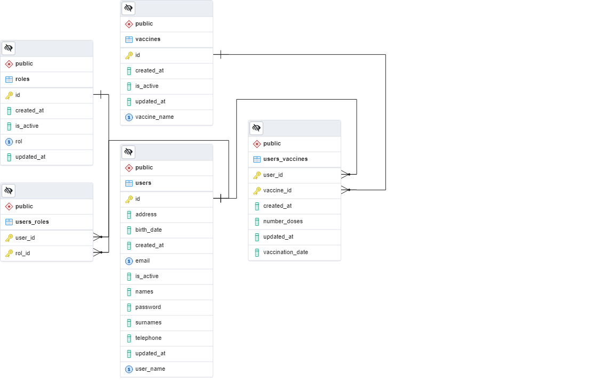

  

  <h3 align="center">Repositorio de Vacunas</h3>

  

    Instructivo de los pasos realizados para el desarrollo de la API de Registro de vacunación
     
  
  

### Modelo de la base de datos
  Para la creación de la base de datos se analizo cual seria la clave primaria para el usuario, en este caso se pueden dar dos posibilidades que a tener en cuenta, la primera es la cédula de la persona y la otra es el nombre de usuario; en este caso se selecciono la cédula puesto que un nombre de usuario puede esta asociado a varias cédulas.
  Ademas para asegurarnos de que el mismo usuario no pueda ser ingresado dos veces se realizo un constraint sobre dicho campo.
  
    En la siguiente imagen se muestra el modelo Entidad relacion empleado para modelar la base de datos.

    

### Usuario administrador 
    El usuario administrador por defecto tiene los siguientes datos:
    - Id: `0105476097`
    - email: `jonnathancampoberde@gmail.com`
    - password: `0105476097`
    Para crear los roles de los usuarios hay un paquete llamada Util, dentro de este paquete se hay un script que se encuentra comentado. Con este Script se crean los ROLES ADMIN, USER y un usuario admin para poder acceder.

    Este usuario es el unico que se encuentra como administrador en la base de datos, todos los usuario que se encuentran ingresados tienen el Rol de USER.

### Seguridad implementada
    Los usuarios por defectno solo pueden acceder a los campos que no estan definidos con el Rol de User

### Acceder al Swagger y probar la API
    Para probar la API empleando Swagger se debe de ingresar desde el siguiente enlace: /swagger-ui/index.html 